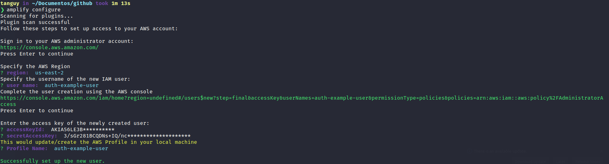
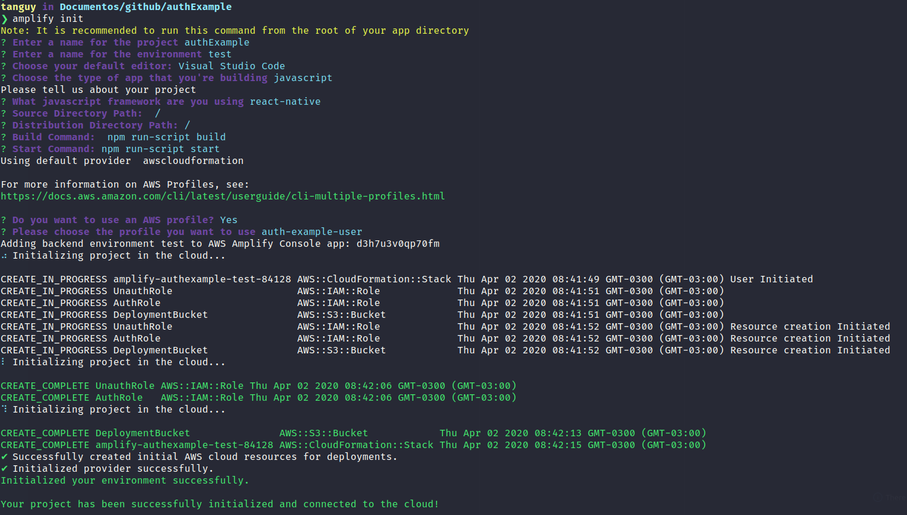

<p align="center">
  
</p>

<h1 align="center">AWS Amplify Cognito Authentication React Native
</h1>

<h4 align="center">
  Complete AWS Cognito authentication flow boilerplate using amplify in react native, with redux login persist
</h4>

<p align="center">
  
  
  <a href="https://github.com/tanguy-roberjot/aws-amplify-authentication-react-native/commits/master">
    
  </a>

  <a href="https://github.com/tanguy-roberjot/aws-amplify-authentication-react-native/issues">
    
  </a>
 </p>


---

## Installation


### Clone

- Clone this repo to your local machine using `https://github.com/tanguy-roberjot/aws-amplify-authentication-react-native.git`

### Setup


> install and configure the amplify CLI

```shell
$ npm install -g @aws-amplify/cli
$ amplify configure
```
> create your IAM User and fill your accessKeyId and secretAccessKey:



> initialize amplify

```shell
$ amplify init
```
> answer the questions like this: 



> add Authentication service to your amplify configuration 

```shell
$ amplify add auth
```


> push your configuration to the cloud

```shell
$ amplify push
```

> you're ready to run the project

```shell
$ cd aws-amplify-authentication-react-native
$ yarn
$ react-native start
```
```shell
$ react-native run-android
or
$ react-native run-ios
```


## Contributing

> To get started...

### Step 1

- **Option 1**
    - Fork this repo!

- **Option 2**
    - Clone this repo to your local machine using `https://github.com/tanguy-roberjot/aws-amplify-authentication-react-native.git`

### Step 2

- **HACK AWAY!** 🔨🔨🔨

### Step 3

- 🔃 Create a new pull request using <a href="https://github.com/tanguy-roberjot/aws-amplify-authentication-react-native/compare/" target="_blank">`https://github.com/tanguy-roberjot/aws-amplify-authentication-react-native/compare/`</a>.

---

## License

[](http://badges.mit-license.org)

- **[MIT license](http://opensource.org/licenses/mit-license.php)**
